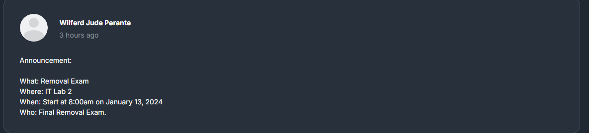

## Disclaimer
Base Rani sa Ako Nahibaw An 


# Exam Preparation for OOP



This repository is dedicated to preparing for Object-Oriented Programming (OOP) exams, based on the content from Sir Perante's YouTube channel.

## Table of Contents
- [Introduction](#introduction)
- [Resources](#resources)
- [How to Use This Repository](#how-to-use-this-repository)
- [Contributing](#contributing)
- [License](#license)

## Introduction
This repository contains notes, code examples, and practice problems to help you prepare for your OOP exams. The material is based on the lectures and tutorials from Sir Perante's YouTube channel.

## Resources
- [Sir Perante's YouTube Channel](https://www.youtube.com/@WilferdJudeAbarsosaPerante)

## How to Use This Repository
1. Clone the repository to your local machine.
    ```bash
    git clone https://github.com/KJTL290/Exam_Preparation_OOP.git
    ```
2. Navigate through the folders to find notes, code examples, and practice problems.
3. Follow along with Sir Perante's videos for a comprehensive understanding.

## Contributing
Contributions are welcome! Please fork the repository and create a pull request with your changes.

## License
This project is licensed under the MIT License. See the [LICENSE](LICENSE) file for details.